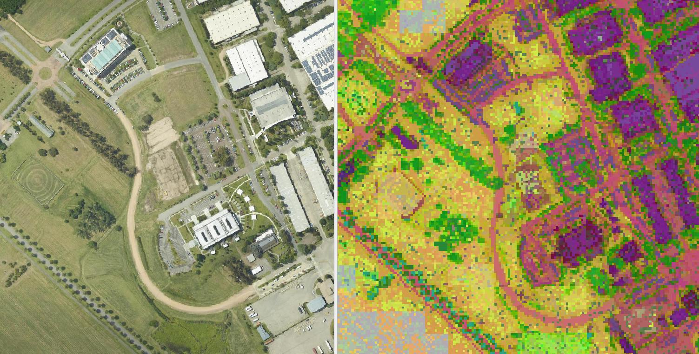

# K-Means GeoCentroids for DinoV2
How closely self-supervised learning can align with human perception.


# Files

- inference.ipynb - jupyter notebook with inference code
- centroids_6k.npy - centroids as np array
- color_map_rgb_6k.npy - centroids ids to rgb colors as np array
- ./examples - three example images grabbed from OpenAerialMap

Input files been rescaled and reprojected using GDAL
```
gdal_string = """
rm -f reprojected.tif

echo "Started {n}"
echo "Path {in_file}"

gdalwarp \
-t_srs {dst_crs_epsg} \
-r bilinear \
-tr {gsd} {gsd} \
-co COMPRESS=LZW \
-co BIGTIFF=YES \
-co TILED=YES \
{in_file} reprojected.tif

gdal_translate \
reprojected.tif {out_file} \
-of COG \
-co TILED=YES \
-of COG \
-co COMPRESS=JPEG \
-co BIGTIFF=YES \
-co NUM_THREADS=ALL_CPUS \
-co OVERVIEWS=IGNORE_EXISTING

echo "Finished {n}" """.format(n=n,
                               in_file=src_path,
                               out_file=os.path.join(output_dir,os.path.basename(src_path)),
                               gsd=output_gsd, dst_crs_epsg=str(dst_crs))
```

# Idea:

In remote sensing data, there should be fewer features than in all data in the Dino training set, especially for a specific GSD and a specific continent. It should be possible to cluster and represent them as cluster IDs.


The way:

- We have the Meta Dino v2 model, which could output features as the last hidden layer.

- Model has been trained on a very-very-very big and diverse dataset in an unsupervised way by Meta. Features should represent real objects, at least in most cases.

- In remote sensing with specified GSD, the diversity of objects is much less than in the train dataset. If we clusterize features, we will have objects as cluster IDs.

- Let clusterise features to classes using the K-Means algorithm. Then, reduce the dimensionality of the features from 768 to 3 using t-SNE to group the RGB colors naturally.

- We can clearly see buildings, roads and trails, trees and forests, fields, and water bodies.
- We can see special objects like boulders in the mountains, and plant patterns on agricultural fields.


* I have not used DinoV3 because Meta added many more restrictions to their license, compared to DinoV2.


For this experiment I used 0.25-meter GSD imagery, both from UAV and satellite. The satellite had a GSD of 0.3-0.5 meters - I rescaled it to be 0.25m. Images downloaded from OpenAerialMap and cover South America region.

K-Means clustering was applied to approximately 4,000,000 features extracted from 2,000 aerial images, resulting in 6,000 distinct clusters.

The same set of clusters performs consistently across all images - roads, buildings, and water bodies are represented with the same colors
